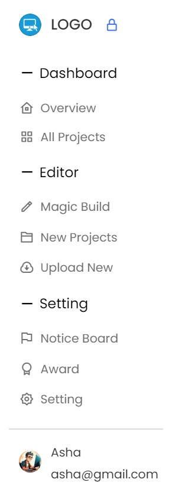

# vertical-menu-2

## Short description of project:
The hoverable sidebar menu includes sections like Dashboard, Editor, and Setting, each containing multiple items. It also features a profile area displaying a user's image, name, and email. The menu hides and shows upon mouse hover and can be locked in the open position with a lock.

## Demo

## Prerequisites
Before you begin, ensure you have met the following requirements:
- Git must be installed on your operating system.

## Installing
To install, follow these steps:

## Linux and macOS:
sudo git clone https://github.com/BatigAndriy/vertical-menu-2

## Windows:
git clone clone https://github.com/BatigAndriy/vertical-menu-2

## License
This project is free to use and does not contain any license.

